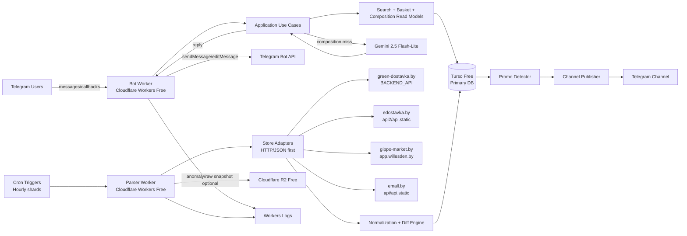

# ARCHITECTURE — Smart Grocery Assistant (Minsk)

Сегодня: 2026-03-29
Статус: Architecture ready for engineering handoff

## 0. Проверка входных данных

### 0.1 Подтвержденный стек технологий

| Area | Choice | Why this fits `$0` + `24/7` |
| --- | --- | --- |
| Bot runtime | Cloudflare Workers Free + Telegram webhook | Webhook работает без "вечно живого" процесса и не зависит от ПК пользователя |
| Parser runtime | Separate Cloudflare Worker with Cron Triggers | Парсер отделен от бота и может работать по расписанию без отдельного сервера |
| Main DB | Turso Free (libSQL/SQLite managed) | Лучше выдерживает историю цен на free tier, чем D1 free write cap |
| LLM | Gemini `gemini-2.5-flash-lite` | Бесплатный input/output tier, достаточно силен для разборов состава и диалога |
| Optional raw archive/export | Cloudflare R2 Free | Удобен для CSV/JSON export и хранения сырого snapshot-подтверждения |
| Observability | Workers Logs + parser/admin tables in Turso | Бесплатно и достаточно для early-stage production |

### 0.2 Подтвержденный формат

- Основной интерфейс: Telegram bot.
- Второй интерфейс: Telegram channel для авто-постинга промо.
- Дополнительный интерфейс: operator/admin commands внутри Telegram.
- GUI/Web frontend в первой архитектурной итерации не требуется.

### 0.3 Подтвержденный архитектурный стиль

- Базовый стиль: modular monolith.
- Деплой-стиль: split runtimes.
- Практическая форма: два независимых deployable компонента на одном архитектурном ядре:
  - `bot-worker` — всегда доступный webhook endpoint.
  - `parser-worker` — scheduled ingestion pipeline.

`Service decomposition not needed: modular monolith is sufficient because business rules, normalization logic, basket optimization, and channel publication share one schema and one bounded domain, while free-tier constraints penalize extra moving parts.`

### 0.4 Возможные технические несостыковки

- `24/7` плюс `$0` несовместимы с "обычным" always-on VPS. Решение: webhook-first/serverless, а не long polling daemon.
- Cloudflare Workers Free дает `10 ms` CPU на HTTP request. Значит бот должен быть thin-controller, а тяжелые вычисления и любые длинные операции должны быть предрасчитаны, закэшированы или вызываться лениво.
- Cloudflare Cron на free пригоден только при расписании `>= 1 hour`, потому что именно тогда доступно до `15 min` CPU на запуск. Сканирование каждые 5-15 минут под `$0` закладывать нельзя.
- D1 Free слишком тесен как primary DB для истории цен: `100,000 rows written/day`. Для нескольких магазинов это риск ceiling. Поэтому primary DB выбран не D1, а Turso.
- Если потребуется near-real-time мониторинг "каждые несколько минут", текущая архитектура останется корректной по модулям, но перестанет укладываться в strict `$0`.

## 1. Concrete Free Stack With Limits

| Need | Service | Verified free-tier facts | Architectural note |
| --- | --- | --- | --- |
| Always-available bot endpoint | Cloudflare Workers Free | `100,000` requests/day, `10 ms` CPU per HTTP request, `128 MB` memory | Подходит только для webhook, не для long polling |
| Scheduled parser | Cloudflare Cron Triggers on Workers Free | `5` cron triggers/account; cron invocations have `15 min` wall time; CPU for cron is `15 min` when interval `>= 1 hour` | Поэтому делаем hourly sharded scans |
| Shared business runtime | Service Bindings | Internal Worker-to-Worker calls do not add request fees | Позволяет разделить bot/parser без доплаты |
| Main database | Turso Free | `100` databases, `5GB` storage, `500M` rows read/month, `10M` rows written/month | Лучше для history + read models |
| LLM for advice | Gemini 2.5 Flash-Lite | Free input/output pricing; model-specific RPM/TPM/RPD are enforced per project and published in AI Studio; docs note RPD resets at midnight Pacific | На production path использовать без обязательного grounding |
| Optional archive/export | Cloudflare R2 Free | `10 GB-month`, `1M` Class A ops/month, `10M` Class B ops/month | Для CSV export и raw snapshots по аномалиям |
| Runtime logs | Workers Logs Free | `200,000` log events/day, `3 days` retention | Достаточно для MVP + parser audit tables |

### Rejected alternatives

| Alternative | Rejected because |
| --- | --- |
| Cloudflare D1 as primary DB | `100,000 rows written/day` слишком легко упереть ценовыми обновлениями и индексами |
| Always-on free VM as primary runtime | Усложняет ops и хуже соответствует требованию strict `$0` + 24/7 |
| Gemini 2.0 Flash-Lite | Deprecated and scheduled for shutdown on `2026-06-01` |
| Browser-based Playwright scraping | Слишком дорог по CPU/runtime и не нужен, если уже видны JSON/API следы |

## 1.1 Слои системы

### Presentation Layer

Ответственность:
- Прием Telegram webhook updates.
- Формирование human-readable bot replies.
- Формирование channel posts.
- Admin/operator commands.

Что входит:
- Telegram update controller.
- Callback/pagination token router.
- Channel message formatter.
- Export command surface.

Что НЕ входит:
- SQL-запросы напрямую.
- Store-specific scraping.
- Доменные правила бюджета, дедупликации и цены.

### Application Layer

Ответственность:
- Оркестрация use cases.
- Транзакционные границы.
- Retry, timeout, rate-limit orchestration.
- Вызовы репозиториев, parser adapters, LLM gateway и publisher clients.

Что входит:
- `SearchOffersUseCase`
- `BuildBudgetBasketUseCase`
- `ExplainCompositionUseCase`
- `RunStoreScanUseCase`
- `PublishChannelDealsUseCase`
- `ExportPriceHistoryUseCase`

Что НЕ входит:
- Реализация Telegram HTTP client.
- SQL dialect specifics.
- HTML/JSON parsing конкретного магазина.

### Domain Layer

Ответственность:
- Инварианты предметной области.
- Нормализация офферов.
- Правила определения скидок.
- Сбор корзины под бюджет.
- Оценка состава и пищевого профиля.

Что входит:
- Entities: `Store`, `SourceOffer`, `CanonicalProduct`, `CurrentOffer`, `PricePoint`, `BasketPlan`, `CompositionProfile`, `PromoCandidate`
- Value objects: `MoneyBYN`, `Quantity`, `UnitPrice`, `SourceFingerprint`, `NutritionFlags`
- Policies: `price-drop-detection`, `duplicate-suppression`, `basket-ranking`, `stale-data-degradation`

Что НЕ входит:
- HTTP clients.
- SQL schema plumbing.
- Secrets/config loading.

### Infrastructure Layer

Ответственность:
- Реальные интеграции с Telegram, Turso, Gemini, R2 и сайтами магазинов.
- Репозитории, кэш, логирование, сериализация.

Что входит:
- Store adapters.
- Telegram API client.
- Gemini gateway.
- Turso repositories.
- Optional R2 export/archive writer.
- Observability adapters.

Что НЕ входит:
- Решения о пользовательских сценариях.
- Формулировка доменных правил.

## 1.2 Границы модулей

| Module | Назначение | Публичный интерфейс | Зависимости | Что запрещено |
| --- | --- | --- | --- | --- |
| `bot-worker` | Принимает Telegram webhook и отвечает пользователю | `handleTelegramUpdate(update)` | Application layer, Telegram client, cache | Прямой доступ к store APIs и сырым SQL query strings из handler |
| `parser-worker` | Запускает scheduled scans по магазинам | `runScheduledScan(storeShard, at)` | Store adapters, normalization, repositories | Генерировать Telegram ответы пользователю |
| `store-adapters` | Извлекает сырые офферы и акции из каждого магазина | `fetchCatalogShard(cursor)` `fetchPromoFeed()` | HTTP fetch, source config | Писать в Telegram, знать о user profile |
| `normalization-core` | Сводит офферы магазинов к canonical model | `normalizeOffer(rawOffer)` `mergeIntoCanonicalProduct()` | Domain entities, taxonomy tables | Ходить в сеть или LLM |
| `price-history` | Ведет current state и append-only историю | `upsertCurrentOffer()` `appendPricePointIfChanged()` | Turso repositories | Решать, что публиковать в канал, без domain policy |
| `search-read-model` | Обеспечивает быстрый поиск, фильтры и пагинацию | `searchOffers(query, cursor)` | Current offers, denormalized tables, cache | Парсить внешние сайты |
| `basket-planner` | Собирает корзину под бюджет и ограничения | `buildBudgetBasket(request)` | Search/read model, domain scoring | Прямо обращаться к Telegram или source APIs |
| `nutrition-advisor` | Анализирует состав, аллергенность и "полезность" | `analyzeComposition(compositionHash)` | Gemini gateway, cached composition profiles | Вызывать LLM без cache key и quota guard |
| `promo-detector` | Находит сильные падения цен и кандидатов в канал | `detectPromoCandidates(window)` | Current offers, price history, publish log | Публиковать без dedupe/idempotency |
| `channel-publisher` | Публикует канал и персональные уведомления | `publishPromo(postDraft)` | Telegram client, publish log | Считать скидки и формировать candidates самостоятельно |
| `ops-admin` | Управляет health, stale-state, экспортом и ручными перезапусками | `runHealthCheck()` `exportHistory()` `retryShard()` | Repositories, archive writer | Тянуть магазинные данные мимо parser orchestration |

## 1.3 Потоки данных

### Основной пользовательский сценарий

1. Пользователь пишет боту: "уложись в 50 руб", "найди дешевое масло", "разбери состав".
2. `bot-worker` принимает webhook и валидирует update type, user id, payload version и callback cursor.
3. Application layer выбирает use case.
4. Use case читает готовые read models из Turso.
5. Если нужен совет по составу:
   - сначала ищется `composition_hash` cache;
   - только при miss вызывается Gemini;
   - результат сохраняется и переиспользуется.
6. Bot formatter строит ответ.
7. Telegram API отправляет сообщение.

### Поток scheduled parsing

1. `parser-worker` запускается по hourly cron.
2. Каждый cron обслуживает один store shard.
3. Adapter вытаскивает только shard cursor, а не весь магазин целиком.
4. Сырые payloads проходят source-schema validation.
5. `normalization-core` превращает их в canonical offers.
6. `price-history`:
   - обновляет `current_offer`;
   - пишет `price_history` только если цена, скидка, наличие или unit-price реально изменились.
7. `promo-detector` находит сильные падения.
8. `channel-publisher` публикует только новые promo keys.

### Где происходят проверки

| Checkpoint | Что проверяется |
| --- | --- |
| Webhook boundary | Secret token, allowed update type, payload size, callback version |
| Use case boundary | Business input schema, budget bounds, supported filters |
| Store adapter boundary | Response code, content type, schema fingerprint, anti-empty payload check |
| Normalization boundary | Единицы измерения, валюта, quantity parsing, canonical product matching |
| Persistence boundary | Idempotency key, uniqueness, stale cursor, transaction outcome |
| LLM boundary | Prompt size, cached hash, rate budget, response schema |
| Publishing boundary | Duplicate promo key, post length and cooldown window |

### Где происходит логирование

- Вход в `bot-worker`: `update_id`, `user_id`, `flow`, `trace_id`.
- Вход в `parser-worker`: `run_id`, `store`, `cursor`, `expected_shard`.
- Каждый upstream fetch: `endpoint`, `status`, `duration_ms`, `bytes`.
- Каждая нормализация: counts of `new`, `updated`, `unchanged`, `rejected`.
- Каждая публикация: `promo_key`, `channel_message_id`, `dedupe_result`.
- Каждый LLM вызов: `composition_hash`, `cache_hit`, `latency_ms`, `fallback_used`.

## 1.4 Architecture Spec Card

- `Architecture Pattern`: hybrid modular monolith with split serverless runtimes
- `Communication Pattern`: Telegram webhook + scheduled event-driven jobs + SQL + internal service bindings
- `Data Pattern`: mixed CRUD + append-only price history + derived read models
- `Deployment Pattern`: serverless edge + managed SQL + managed LLM API
- `Core Modules / Services`: bot-worker, parser-worker, store-adapters, normalization-core, price-history, promo-detector, basket-planner, nutrition-advisor, channel-publisher, ops-admin
- `Primary Data Stores`: Turso as primary relational store; optional R2 for raw snapshots and exports
- `Failure Hotspots`: store API schema drift, Telegram publish dedupe, Turso write bursts, LLM quota exhaustion, Cloudflare free-tier subrequest ceiling

### Key runtime components

| Component | Inputs / Outputs | Storage | External integrations | Auth / cache / retry / timeout | What must not break |
| --- | --- | --- | --- | --- | --- |
| `bot-worker` | Input: Telegram webhook updates. Output: Telegram replies, callback pagination | Reads Turso; optional cache | Telegram Bot API | Webhook secret token, 2-5s outbound timeout, no heavy CPU, cached read models | User command semantics and callback cursor compatibility |
| `parser-worker` | Input: Cron events. Output: normalized deltas, promo candidates | Writes Turso; optional raw snapshots to R2 | Grocery endpoints | Hourly or slower schedule, per-store cursor lock, 8-10s upstream timeout, retry on 429/5xx with jitter | Idempotent writes and store isolation |
| `price-history store` | Input: normalized offer states. Output: current offers + append-only price points | Turso primary DB | None directly | Transactional upsert + append-on-change | Current price correctness and history continuity |
| `nutrition-advisor` | Input: composition text/hash. Output: structured assessment | Turso cache table | Gemini API | Cache-first, quota guard, response schema validation, 10-12s timeout | Stable schema for advice and explanation formatting |
| `channel-publisher` | Input: promo candidates. Output: channel posts and publish log | Turso publish log | Telegram Bot API | Idempotency key, cooldown window, retry on transient Telegram errors | No duplicate spam in channel |
| `ops-admin` | Input: admin commands. Output: exports, health summaries, manual retries | Turso + optional R2 | Telegram Bot API | Role allowlist, audit logs, bounded exports | Safe operator control without mutating domain data accidentally |

## Mermaid Diagram

## 2. Нефункциональные требования

### 2.1 Производительность

Assumptions:
- До `10,000` пользователей в launch-phase.
- Пиковый burst бота: до `10` webhook updates/sec.
- До `80,000` live offers across all stores.
- До `3-6 million` rows in `price_history` за первый год.

Требования:
- P50 bot response: `< 1.5s` для поиска и готовых рекомендаций.
- P95 bot response: `< 4s`.
- Composition advice with cache miss: `< 10s`.
- Parser shard run: `< 15 min` wall time и `< 15 min` CPU only because schedule is `>= 1 hour`.

Ограничения памяти:
- Любая Worker invocation обязана удерживаться в `128 MB`.
- Нельзя буферизовать большие каталоги целиком; только shard-by-shard streaming/iterative processing.

Узкие места:
- `50` subrequests per free Worker invocation.
- Upstream schema drift.
- LLM quota.
- DB writes при всплеске обновлений.

Архитектурный ответ:
- Hourly sharding by store.
- Hot shards hourly, cold shards round-robin every `12-24h`.
- Append history only on change.
- Lazy LLM cache by `composition_hash`.

### 2.2 Надежность

- Любой store scan изолирован: падение одного магазина не валит остальные.
- Parser run idempotent по `(store, shard, scheduled_at)`.
- Channel publish idempotent по `promo_key`.
- Retry policy:
  - Store HTTP `429/5xx`: exponential backoff with jitter, max `3` retries in one run.
  - Telegram send failures: max `3` retries for retryable errors.
  - Gemini transient errors: `2` retries, then fallback to cached or heuristic response.
- Timeouts:
  - Store fetch: `8-10s`
  - Telegram outbound: `5s`
  - Gemini: `10-12s`
  - DB query: soft target `< 1s`, hard timeout `< 3s`
- Degradation:
  - Если store недоступен, бот отдает last known data with stale marker.
  - Если Gemini недоступен, composition response falls back to rule-based minimal explanation.

### 2.3 Безопасность

- Секреты хранятся только в Cloudflare encrypted vars и не попадают в repo.
- Webhook endpoint использует `X-Telegram-Bot-Api-Secret-Token`.
- Любой user input проходит schema validation и length limits.
- Нельзя прокидывать произвольные URL пользователя в parser или LLM.
- LLM prompt injection from product text ограничивается:
  - строгим system prompt;
  - schema-bound response;
  - удалением HTML/JS/URLs из input before inference.
- Возможные векторы атак:
  - webhook abuse;
  - quota draining;
  - store response poisoning;
  - duplicate publish storms;
  - prompt injection via composition text.

### 2.4 Логирование и наблюдаемость

Что логировать:
- Parser runs.
- Upstream errors and schema mismatches.
- Changed-offer counts.
- Publish attempts and dedupe decisions.
- LLM cache hits/misses.
- Export jobs.

Уровни:
- `INFO`: normal bot and parser flow.
- `WARN`: stale data, schema drift, partial store failure, quota nearing limit.
- `ERROR`: hard failures, publish failure after retries, DB write failure.

Где хранить:
- Runtime logs: Cloudflare Workers Logs.
- Durable audit: Turso tables `parser_run`, `parser_error`, `publish_log`, `admin_action_log`.
- Optional anomaly payloads: R2.

### 2.5 API / Контракты

Публичные интерфейсы:
- Telegram webhook endpoint.
- Telegram channel posting contract.
- Internal admin command contract.

Contract source of truth:
- Telegram update DTO versioning in `packages/contracts`.
- DB schema migrations as source of truth for persistence.
- If a future HTTP API appears, OpenAPI becomes mandatory source of truth.

Backward compatibility:
- Breaking change считается:
  - изменение callback payload format;
  - удаление команды без migration alias;
  - несовместимое изменение export schema;
  - изменение promo dedupe key semantics.

Error model:

| Field | Meaning |
| --- | --- |
| `code` | stable machine-readable error code |
| `message` | short human-readable text |
| `retryable` | whether caller can retry |
| `trace_id` | correlates logs and DB audit |

Пагинация / фильтры / лимиты:
- Cursor-based pagination in callback data.
- Default page size: `10` items.
- Filters:
  - store
  - price ceiling
  - unit-price sorting
  - promotion only
  - availability only
  - nutrition flags
  - category

Rate limiting:
- Per-user command cooldown.
- Per-store adapter request throttle.
- Per-feature LLM daily guard.

### 2.6 Distributed / Concurrency

- Queue broker в v1 не нужен.
- Free-tier friendly orchestration:
  - один cron shard = один store slice;
  - cursor state хранится в Turso;
  - overlapping runs блокируются lease row в `parser_cursor`.
- Idempotency:
  - parser: `store + shard + scheduled_bucket`
  - history append: `offer_id + observed_price_hash`
  - publish: `channel + promo_key`
- Consistency model:
  - strong consistency нужна для `current_offer`, `publish_log`, `parser_cursor`
  - eventual consistency допустима для read models и composition cache
- Failure handling:
  - store outage only marks that store stale
  - DB outage pauses writes and publishing but bot can still serve cached last snapshot when available

## 3. Стратегия парсинга без тяжелых браузеров

### 3.1 Main principle

Продакшн-парсер не использует headless browser. Он работает только через:
- public JSON endpoints;
- SSR bootstrapped data;
- runtime config values;
- predictable catalog/search endpoints;
- lightweight HTML extraction only as fallback.

### 3.2 What was already observed live

- `green-dostavka.by` exposes runtime `BACKEND_API=https://green-dostavka.by/api`.
- `edostavka.by` exposes `api.static.edostavka.by` and `api2.edostavka.by`.
- `emall.by` exposes `api.emall.by`, `api.static.emall.by`, `api-preprod.emall.by`.
- `gippo-market.by` preconnects to `app.willesden.by`.

This means the system can begin with site-visible API discovery instead of browser automation.

### 3.3 Recommended parsing approach

Stage A: endpoint discovery
- Read landing HTML.
- Extract runtime config, manifests, JS bundle strings, XHR URLs, preconnect domains.
- Identify promo feeds, catalog endpoints, search endpoints, product detail endpoints.

Stage B: adapter design
- One adapter per store.
- Every adapter returns a common `RawStoreOffer`.
- Source-specific fields go into `source_payload_meta`, never leak into domain entities.

Stage C: sharded scheduled ingestion
- `5` cron slots maximum on free Cloudflare.
- Recommended cron allocation:
  - `03 * * * *` Green
  - `18 * * * *` Edostavka
  - `33 * * * *` Gippo
  - `48 * * * *` Emall
  - `57 * * * *` housekeeping / recompute / export cleanup
- Each run processes only one shard cursor, not full catalog.

Stage D: diff-first persistence
- No full snapshot writes every hour.
- Save new `price_history` row only if one of these changed:
  - absolute price
  - discount percent
  - availability
  - effective unit price
  - promo tag set

Stage E: anomaly handling
- If response schema changes, adapter returns `SCHEMA_DRIFT`.
- Raw payload hash and minimal sample can be archived to R2.
- Store is marked degraded but others continue.

### 3.4 Reverse-engineering mobile API: where it fits

Reverse-engineering mobile API is recommended only as discovery/bootstrap work:
- identify hidden JSON endpoints;
- recover version headers and pagination params;
- understand promo/category resources faster than by DOM inspection.

But production should still call stable public HTTP endpoints discovered from:
- site runtime config;
- site bootstrapped JSON;
- public app/web API domains.

This avoids making runtime availability depend on APK reverse engineering or certificate pinning workarounds.

### 3.5 Anti-block strategy

- No Playwright in scheduled path.
- No full-site crawling.
- No anonymous browser sessions for every run.
- Prefer promo feeds and category lists over per-product fanout.
- Product detail fetch only for:
  - new product
  - changed product
  - missing composition
  - suspicious schema delta

## 4. Data model

### Core tables

| Table | Purpose |
| --- | --- |
| `store` | source store registry |
| `store_endpoint` | source API/HTML endpoint inventory and adapter config |
| `canonical_product` | normalized product identity across stores |
| `source_offer` | raw source-side product identity |
| `current_offer` | latest price/availability per store offer |
| `price_history` | append-only history on real changes |
| `promo_candidate` | computed deals awaiting publish/dedupe |
| `publish_log` | channel/user notification dedupe |
| `composition_profile` | cached structured nutrition/composition assessment |
| `basket_request_log` | optional analytics for optimization quality |
| `parser_cursor` | per-store shard progress and lease lock |
| `parser_run` | run audit and metrics |
| `parser_error` | structured parser failures |
| `user_profile` | preferences, allergies, budget defaults |
| `user_subscription` | price drop watches and category subscriptions |

### Important modeling rules

- `current_offer` is mutable.
- `price_history` is append-only.
- `composition_profile` is keyed by normalized ingredient hash, not by SKU only.
- `canonical_product` and `source_offer` are separate to avoid over-merging brands, pack sizes and store variants.

## 5. Search / Filters / Export / Notifications / Offline / Cache / Pagination

### Search and filters

- Search is served from `search-read-model`.
- Required filters:
  - store
  - price ceiling
  - unit-price sorting
  - promotion only
  - availability only
  - nutrition flags
  - category

### Export

- Admin export flows:
  - `/export price-history <store> <date-range>`
  - `/export promos <date-range>`
  - `/export catalog-snapshot <store>`
- Result format: CSV or JSON.
- Small exports can be sent directly as Telegram document.
- Larger exports can be staged in R2 and returned as expiring link.

### Notifications

- Channel autopost: strong drops, new promos, curated daily digest.
- User notifications:
  - watch product
  - watch category
  - watch budget basket threshold

### Offline / degradation

- If one or more stores are stale, bot still answers with last known data and a freshness badge.
- If all stores stale, bot switches to "catalog snapshot mode".
- If LLM unavailable, composition advice becomes rule-based minimal assessment.

### Cache

- Cache only read-heavy, deterministic data.
- Good cache targets:
  - search pages
  - budget basket results for popular presets
  - composition assessments
  - promo digest drafts
- Do not use KV for hot mutable transactional state because free write budget is too small.

### Pagination

- Cursor pagination in callback buttons.
- Callback payload contains:
  - version
  - query hash
  - filter hash
  - cursor

## 6. Структура проекта

| Path | Назначение | Что помещается | Что не должно попадать |
| --- | --- | --- | --- |
| `apps/bot-worker/` | Telegram webhook runtime | controllers, webhook routing, response formatting | store scraping, raw SQL, runtime data files |
| `apps/parser-worker/` | Scheduled parser runtime | cron handlers, shard scheduling, ingestion orchestration | Telegram chat UI logic |
| `packages/domain/` | Domain model | entities, value objects, policies | HTTP clients, DB-specific code |
| `packages/application/` | Use cases | orchestrators, command/query handlers | framework/webhook adapters |
| `packages/infrastructure/` | Real integrations | Turso repos, Telegram client, Gemini client, source adapters, cache | domain invariants |
| `packages/contracts/` | Shared DTO contracts | update schemas, callback payload schemas, export contracts | business logic |
| `packages/config/` | Typed configuration | env parsing, service limits, feature flags | secrets in plain text |
| `tests/unit/` | Unit tests | domain and application tests | live-network tests |
| `tests/integration/` | Integration tests | adapter fixtures, repo tests, webhook flow tests | long-running load tests |
| `tests/smoke/` | Smoke checks | deploy-time health and minimal live checks | large fixture sets |
| `docs/` | Project memory and architecture | all decision/state/history docs | generated runtime logs/db files |
| `scripts/` | One-click dev/deploy helpers | bootstrap, local verify, export helpers | application state |

### Runtime file rule

Runtime-mutable files must never be stored in repo paths.

For local dev only:
- Windows: `%LOCALAPPDATA%\\SmartGroceryAssistant\\`
- Temp files: system temp directory

## 7. План реализации

### Stage 1 — Foundation

Цель:
- Поднять monorepo structure, contracts, typed config, DB schema baseline, Workers projects.

Критерий завершения:
- Two Workers deploy independently.
- Turso schema migrates cleanly.
- Telegram webhook health endpoint responds.

### Stage 2 — Core parser and data model

Цель:
- Реализовать store adapters, normalization, current offers, price history, parser cursors.

Критерий завершения:
- Hourly shard run successfully ingests at least one store end-to-end.
- `current_offer` and `price_history` fill correctly.

### Stage 3 — Bot user flows

Цель:
- Реализовать search, filter, pagination, budget basket, stale-data degradation.

Критерий завершения:
- Bot returns useful results from stored data without hitting store APIs synchronously.

### Stage 4 — Advice and publishing

Цель:
- Добавить composition analysis, promo detection, channel publisher, subscriptions.

Критерий завершения:
- New or changed product composition is cached.
- Promo candidate dedupe works.
- Channel post is published exactly once.

### Stage 5 — Error handling and quality

Цель:
- Довести retries, timeout policies, health checks, audit tables, exports, logs.

Критерий завершения:
- Partial store failures no longer break the whole pipeline.
- Operator can see stale stores and failed shards.

### Stage 6 — Integration and deployment hardening

Цель:
- Закрыть one-click deployment, secrets wiring, smoke tests, and operator readiness.

Критерий завершения:
- Full cloud stack deploys from repo.
- Bot and parser work without local machine.

## 8. Точки контроля качества

### Unit tests

Писать в:
- `tests/unit/domain`
- `tests/unit/application`

Обязательно покрыть:
- normalization rules
- append-on-change logic
- basket ranking
- promo candidate thresholds
- callback cursor encoding/decoding
- stale-data degradation

### Integration tests

Писать в:
- `tests/integration/adapters`
- `tests/integration/repositories`
- `tests/integration/bot-flow`

Обязательно покрыть:
- one store adapter happy path from fixture to normalized offer
- Turso repository upsert semantics
- parser cursor locking
- publish dedupe
- composition cache hit/miss behavior

### Smoke tests

Писать в:
- `tests/smoke`

Обязательно покрыть:
- webhook health
- one parser shard run against recorded fixture
- Telegram send sandbox check

### Что можно оставить без тестов

- Thin DTO mappers with no branch logic.
- Static config constants.
- Pure formatting templates with snapshot coverage only.

## 9. Потенциальные архитектурные риски

| Risk | Where it appears | Mitigation |
| --- | --- | --- |
| Tight coupling between store adapters and domain schema | Parsing layer | Anti-corruption layer and per-store contract tests |
| Write-budget exhaustion | Price history | Append only on meaningful change, not every scan |
| Worker subrequest ceiling | Parser on free tier | Shards, cursor rotation, hot/cold scanning strategy |
| LLM quota exhaustion | Nutrition advisor | Cache by composition hash, lazy analysis, heuristic fallback |
| Duplicate spam in channel | Publisher | Stable promo key + publish log + cooldown windows |
| Store schema drift | Source adapters | Schema fingerprints, anomaly snapshots, degraded-store mode |
| Search quality drift | Canonical product matching | Explicit taxonomy tables and reviewable merge rules |

## 10. Готовность к передаче программисту

### Четкий технический план

1. Реализовать shared contracts, config и Turso schema.
2. Поднять `parser-worker` с одним store adapter и shard cursor.
3. Реализовать `current_offer` + `price_history`.
4. Поднять `bot-worker` и search flow поверх read models.
5. Добавить basket planner.
6. Добавить composition cache + Gemini gateway.
7. Добавить promo detector + channel publisher.
8. Добавить exports, ops, stale-state controls.

### Финальная структура проекта

- `apps/bot-worker`
- `apps/parser-worker`
- `packages/domain`
- `packages/application`
- `packages/infrastructure`
- `packages/contracts`
- `packages/config`
- `tests/unit`
- `tests/integration`
- `tests/smoke`
- `scripts`
- `docs`

### Список модулей для реализации

- Telegram webhook entry
- Bot response formatter
- Search read model
- Basket planner
- Nutrition advisor
- Parser orchestrator
- Green adapter
- Edostavka adapter
- Gippo adapter
- Emall adapter
- Normalization core
- Current offer repository
- Price history repository
- Promo detector
- Channel publisher
- Admin/ops module

### Порядок разработки

1. Foundation and schema
2. One store end-to-end parser
3. Search and listing in bot
4. Price history and promo detection
5. Remaining store adapters
6. Basket planner
7. Composition advisor
8. Notifications, exports, ops

## 11. Source Notes

- Cloudflare Workers limits: https://developers.cloudflare.com/workers/platform/limits/
- Cloudflare Workers pricing: https://developers.cloudflare.com/workers/platform/pricing/
- Cloudflare Cron Triggers: https://developers.cloudflare.com/workers/configuration/cron-triggers/
- Cloudflare D1 pricing: https://developers.cloudflare.com/d1/platform/pricing/
- Turso pricing: https://turso.tech/pricing
- Gemini pricing: https://ai.google.dev/gemini-api/docs/pricing
- Gemini rate limits: https://ai.google.dev/gemini-api/docs/rate-limits
- Live targets checked on 2026-03-29:
  - https://green-dostavka.by
  - https://edostavka.by
  - https://gippo-market.by
  - https://emall.by
